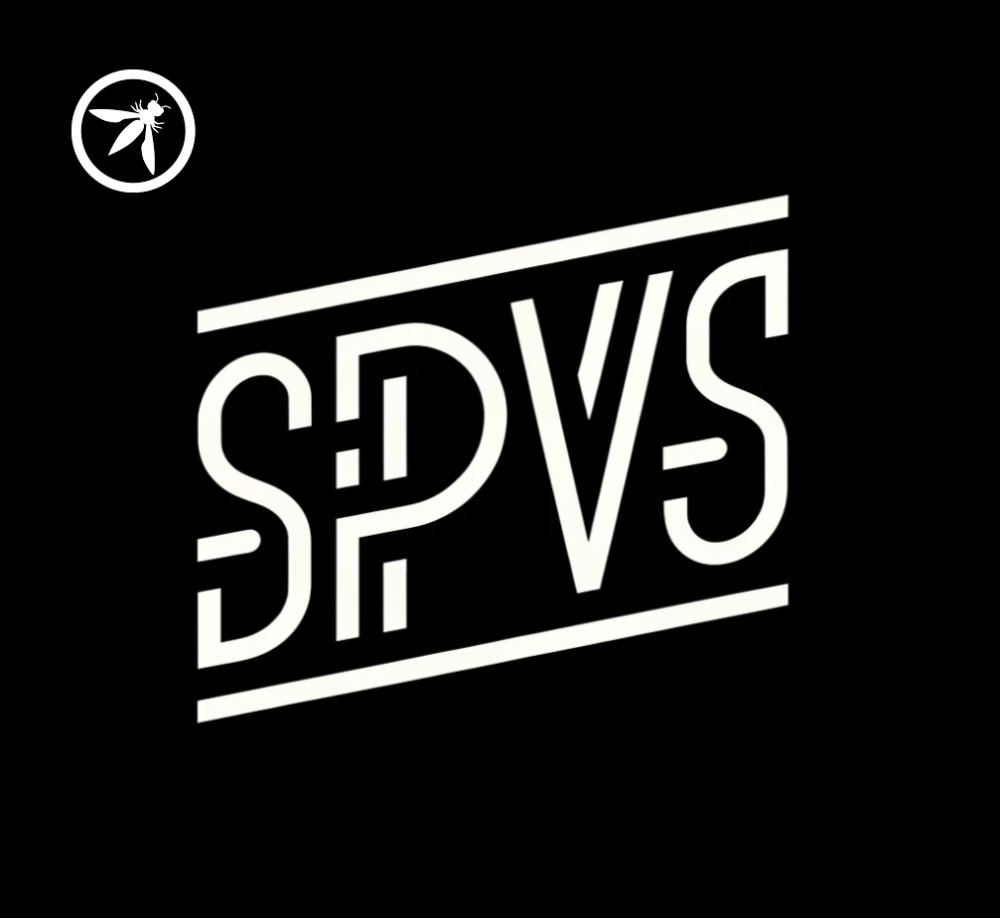

# COMING SOON 2024

## Project - Secure Pipeline Verification Standard (SPVS)
---

## SPVS Overview:

The SPVS is a detailed guide containing a robust set of controls designed for software engineers, DevOps/DevSecOps engineers and security teams. It aims to assess and enhance the security maturity of software development pipelines, with a focus on managing the risks associated with code and artifact handling throughout the entire pipeline lifecycle, from inception to delivery.

### Key aspects of the guide will include:

1. Multilevel Control Framework: The guide will present a tiered structure of controls, catering to various levels of expertise and security needs. This will enable organizations to implement appropriate measures based on their current maturity and progress towards more advanced pipeline security practices.
2. Progressive Implementation Pathway: A clearly defined, step-by-step pathway will be outlined, guiding users from fundamental to sophisticated security implementations. This ensures a practical and scalable approach for improving pipeline security over time.
3. Customizable and Adaptable Controls: The guide will offer flexible controls that can be tailored to diverse software development environments. This adaptability ensures the relevance and applicability of the guide across different operational models and methodologies used in code and software management.
4. Comprehensive Coverage: The guide will encompass a wide range of topics, including secure code management, artifact integrity, automation of security tasks within the CI/CD pipeline, compliance monitoring, and incident response strategies.
5. Actionable and Dynamic Resource: The primary goal is to provide a dynamic, actionable resource that not only assesses but also significantly improves the security posture of software development pipelines in organizations of varying sizes and complexities.

SPVS will serve as a critical tool for organizations seeking to strengthen their software pipeline security, providing clear, actionable controls and a framework for concontinuous security improvement.

---

## Key Objective:

To develop a comprehensive standard that guides organizations in creating and maintaining secure software pipelines, encompassing the entire development and deployment lifecycle.

## Goal:

Our goal is to furnish a suite of controls aimed at significantly reducing the risk of attacks on software development pipelines, thereby enhancing the overall security posture of software delivery processes.

## Description of SPVS:
The Secure Pipeline Verification Standard (SPVS) framework is centered around security-focused requirements designed to safeguard software pipelines from inception to deployment. This framework is crafted to provide critical insights and actionable guidance for defending against emerging threats in software management, development, and distribution. It adopts a multi-tiered approach, offering a graduated pathway from fundamental to advanced security levels. This allows organizations to establish a foundational security baseline and progressively advance to best-in-class security practices tailored to their software delivery methods. The framework is structured to be both comprehensive and adaptable, ensuring relevance and effectiveness in diverse operational environments.

## Scope
The Secure Pipeline Verification Standard (SPVS) is designed to comprehensively address the security of software development pipelines. Its scope encompasses the implementation of security controls at various levels of sophistication to manage risks associated with code and artifact handling from inception to delivery. It offers a multilayered control framework, adaptable and customizable for different organizational needs, and covers essential aspects like secure code management, artifact integrity, automated security tasks within CI/CD processes, compliance monitoring, and incident response. The SPVS serves as a vital resource for enhancing the security maturity of software development practices, making it indispensable for organizations seeking to safeguard their development pipelines against evolving security threats.

## Audience 
The primary audience for the Secure Pipeline Verification Standard (SPVS) includes software engineers, DevOps engineers, DevSecOps professionals, Release/Program Managers, and security teams within organizations. It is particularly valuable for those responsible for designing, implementing, and maintaining secure software development pipelines. Additionally, the SPVS is aimed at IT managers and decision-makers who need to understand and mitigate security risks associated with software development. By providing a framework and set of controls for managing security throughout the development lifecycle, the SPVS is essential for any organization looking to strengthen their security practices and ensure the integrity and security of their software products.

---

## Principles

1. **Security Integration**: Integrate security seamlessly into all stages of the software development lifecycle, ensuring that it is not an afterthought but a fundamental aspect of development from the outset.

2. **Continuous Improvement**: Embrace a culture of continuous assessment and improvement of security practices to adapt to emerging threats and evolving technology landscapes.

3. **Responsibility and Ownership**: Encourage shared responsibility for security across all teams involved in the software development process, including developers, operations, and security professionals, ensuring that security is everyone’s priority.

4. **Transparency and Collaboration**: Foster an environment of openness and collaboration between different teams, where security risks and incidents are transparently shared and jointly addressed.

5. **Proactive Defense**: Prioritize proactive security measures over reactive responses, implementing preventative controls and early detection mechanisms to mitigate risks before they escalate into security incidents.

6. **Scalability and Flexibility**: Design security controls that are both scalable and flexible, allowing them to be effectively applied in various operational environments and adjusted as per the specific needs and maturity levels of the organization.

7. **Education and Awareness**: Continuously educate and train all stakeholders on the latest security threats and best practices, building a knowledgeable workforce that can effectively contribute to the organization’s security posture.

8. **Standards Compliance**: Ensure that security practices align with relevant industry standards and regulatory requirements, providing a structured approach to compliance and enhancing trust with customers and partners.

9. **Preserve Agile and DevOps Integrity**: Maintain the agility and efficiency of Agile and DevOps practices, ensuring that security measures enhance rather than impede the rapid and iterative nature of development workflows.

10. **Risk-Based Approach**: Utilize a risk-based approach to prioritize security efforts, focusing on the most critical threats and vulnerabilities that could impact the organization’s objectives and assets.

These principles are designed to create a robust framework for the SPVS, guiding organizations in developing secure, resilient, and trustworthy software development practices.

---
## SPVS Stages:
The stages described are integral to both DevSecOps and DevOps practices, with the SPVS (Software Pipeline Vulnerability Standard) enhancing each stage with security-focused guidelines:

1. **Plan**: This initial stage involves defining the scope, objectives, and security requirements of the project. In the context of SPVS, this includes assessing potential security risks, setting security baselines, and planning for security measures that align with the overall business goals.

2. **Develop/Design/Code**: At this stage, developers write code with an emphasis on incorporating security into the design from the start. The SPVS encourages the use of secure coding practices, regular code reviews, and the integration of security tools that can identify vulnerabilities early in the development process.

3. **Build/Package**: This involves compiling code into executable artifacts and ensuring that the build process includes automated security checks. Under the SPVS, this stage would emphasize the security of the build environment and the integrity of the artifacts to prevent tampering and ensure compliance with security standards.

4. **Integrate**: Integration involves merging developed features into the existing codebase. The SPVS supports this stage by advocating for automated security testing and scanning during integration to detect integration issues and vulnerabilities early, enhancing overall security.

5. **Release Ready**: At this point, the software is in its final stages before release. The SPVS ensures that the software meets all security criteria and compliance requirements, conducting final security assessments and audits to validate the readiness for deployment.

6. **Deploy**: Deployment is the process of installing the software in a live environment. According to SPVS principles, this should involve secure deployment practices to protect applications during the transition to production and minimize disruptions while maintaining security.

7. **Operate**: Operation focuses on the ongoing management of the software in production. SPVS encourages maintaining security standards through access controls, secure maintenance practices, and ensuring that operational activities uphold security integrity.

8. **Monitor**: The final stage involves continuous monitoring of the system for any security breaches or failures. SPVS would advocate for the use of real-time security monitoring tools and incident response strategies to quickly identify and mitigate threats, maintaining the security posture over time.

Together, these stages form a comprehensive lifecycle, with the SPVS ensuring that security is a cornerstone throughout the DevSecOps and DevOps processes, from planning through to monitoring.

---

## Roadmap:

Phase 1: Standard Foundation and Contextualization

- Define the Standard: Emphasize its scope and objectives in strengthening pipeline security.
- Establish Clear Goals: Focus on mitigating risks and enhancing security throughout the software development lifecycle.
- Identify Primary Audience: Include developers, DevOps teams, and security professionals.
- Justify the Need: Consider emerging threats and evolving best practices in CI/CD security.
- Lay Down Foundational Principles: Align with existing security frameworks and industry best practices.

Phase 2: Detailed Standard Construction

- Enumerate Essential Stages: Focus on critical CI/CD pipeline stages like code development, testing, deployment, and monitoring.
- Develop a Tiered Security Model: Facilitate gradual implementation with Levels 1 to 3.
- Incorporate Comprehensive Security Considerations: Cover common vulnerabilities and threats, including the OWASP CI/CD Top 10.
- Detail Authentication and Authorization Protocols: Ensure secure identity and access management.
- Emphasize Code and Artifact Integrity: Include non-repudiation and validation measures.
- Implement Least Privilege Principle: Ensure minimal access rights for optimal security.
- Highlight Traceability and Logging: Ensure transparency and accountability.
- Draft Initial Blueprint Layouts: Create blueprint for a generic pipeline with security controls.

Phase 3: Expansion and Specification of Controls

- Populate Each Level with Specific Controls: Ensure controls are actionable and adaptable.
- Expand Layouts/Blueprints/DFDs: Illustrate practical application in different pipeline stages.
- Integrate Continuous Monitoring: Ensure ongoing effectiveness against emerging threats.
- Develop Incident Response Guidelines: Enhance real-world applicability.

Phase 4: Validation and Community Engagement

- Conduct Pilot Testing: Validate effectiveness in diverse environments.
- Engage with the Community: Incorporate feedback from industry experts and researchers.
- Refine the Standard: Based on feedback and testing results.

Phase 5: Finalization and Dissemination

- Finalize the Standard: Incorporate all revisions.
- Develop Comprehensive Documentation: Include user guides and checklists.
- Launch an Outreach Program: Promote adoption through workshops, webinars, and partnerships.